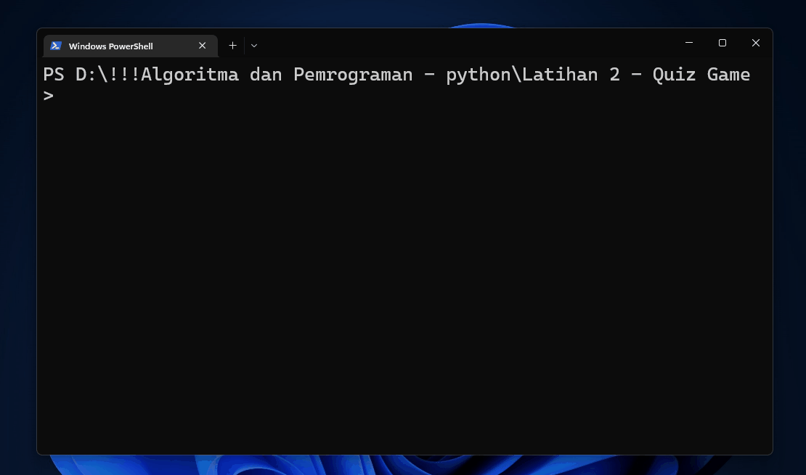

<!-- PROJECT LOGO -->
 

  

  <h3 align="center">Quiz Game</h3>

  

    <samp>Terminal Game with Python</samp>
  

 

### Preview

 

### How to run

1. You need python installed in your machine. To check if your python already installed in your machine first open your terminal, and then type
   `python --version`.

   - To install python you can visit [Python Official Website](https://www.python.org)

2. Clone this github repository. if you already have git installed in your machine, just open your git bash in directory you want, then type
   `git clone https://www.github.com/ibrammalik/Quiz-Game`

   - To install git you can visit [Git Official Website](https://www.git-scm.com).
   - Or you can just download zip file from this repository and extract in your local machine

3. Open your Quiz Game folder, open terminal , and type
   `python main.py`
   now you can enjoy the game! 😉

 

### Techstack

- [Python](https://python.org/) - Quiz Game built with python

 

### Thanks to

- [Freepik](https://www.flaticon.com/authors/freepik) - for free quality Python icon

 

<!-- CONTRIBUTING -->

### Contributing

- For any bug or feature requests, [Submit a issue here](https://github.com/ibrammalik/Quonime/issues).

Also please see the [open issues](https://github.com/ibrammalik/Quonime/issues) for a list of proposed features before submitting one.

 

<!-- LICENSE -->

### About

I started Quiz Game Python as my first starting project with python in 2022

 

<!-- LICENSE -->

### Copyrights

Copyright © 2022 [ibrammalik](https://github.com/ibrammalik)
